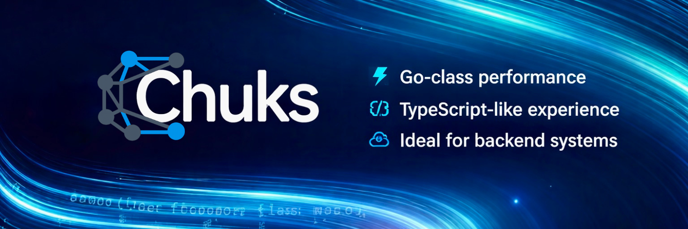

# Chuks Programming Language

<p align="center">
  
</p>

<p align="center">
  <strong>Simple. Fast. Expressive.</strong><br/>
  A modern programming language with a built-in VM, AOT compiler, HTTP server, and structured concurrency, all in a single binary.
</p>

<p align="center">
  <a href="https://chuks.org">Website</a> · <a href="https://chuks.org/getting-started/installation/">Installation</a> · <a href="https://chuks.org/getting-started/why-chuks/">Why Chuks?</a> · <a href="https://github.com/chuks-programming-language/releases/releases">Downloads</a>
</p>

---

## What is Chuks?

Chuks bridges scripting-language simplicity with compiled-language performance. It matches Go's HTTP throughput (127K req/s), beats Java/Node.js/Bun on compute benchmarks, and gives you a developer experience closer to TypeScript or Python.

```chuks
import { createServer, Request, Response } from "std/http"

var app = createServer();

app.get("/", function(req: Request, res: Response) {
    res.send("Hello, World!")
})

app.listen(9000)
```

### Key Features

- **VM + AOT dual mode** — REPL for development, `chuks build` for production native binaries
- **Built-in HTTP server** — Multi-threaded, production-grade, 127K req/s out of the box
- **Structured concurrency** — `spawn` + `await` with automatic parent-child cancellation
- **Static types** — Errors caught at compile time, not in production
- **Classes, generics, closures** — Full OOP with inheritance, abstract classes, and interfaces
- **Package manager** — `chuks add`, `chuks install`, `chuks publish` with semver constraints and supply chain security
- **Single binary deployment** — No runtime, no dependencies
- **Rich standard library** — HTTP, JSON, crypto, JWT, database drivers, file system, and more
- **IDE support** — VS Code extension with go-to-definition, find references, rename, inlay hints, and more

### Performance

| Language  | HTTP req/s  | Fibonacci  | Quicksort  |
| --------- | ----------- | ---------- | ---------- |
| **Chuks** | **127,141** | **0.105s** | **0.009s** |
| Go        | 126,885     | 0.095s     | 0.007s     |
| Bun       | 106,111     | 0.156s     | 0.040s     |
| Node.js   | 91,113      | 0.228s     | 0.044s     |
| Java      | 88,424      | 0.086s     | 0.038s     |
| Python    | 6,114       | 5.35s      | 0.15s      |

---

## Downloads

| Platform | Architecture          | File                                                                                                                                     |
| -------- | --------------------- | ---------------------------------------------------------------------------------------------------------------------------------------- |
| macOS    | Apple Silicon (ARM64) | [`chuks-darwin-arm64.tar.gz`](https://github.com/chuks-programming-language/releases/releases/latest/download/chuks-darwin-arm64.tar.gz) |
| macOS    | Intel (x86_64)        | [`chuks-darwin-amd64.tar.gz`](https://github.com/chuks-programming-language/releases/releases/latest/download/chuks-darwin-amd64.tar.gz) |
| Linux    | x86_64                | [`chuks-linux-amd64.tar.gz`](https://github.com/chuks-programming-language/releases/releases/latest/download/chuks-linux-amd64.tar.gz)   |
| Linux    | ARM64                 | [`chuks-linux-arm64.tar.gz`](https://github.com/chuks-programming-language/releases/releases/latest/download/chuks-linux-arm64.tar.gz)   |
| Windows  | x86_64                | [`chuks-windows-amd64.zip`](https://github.com/chuks-programming-language/releases/releases/latest/download/chuks-windows-amd64.zip)     |

## Quick Install

### macOS / Linux

```bash
# macOS Apple Silicon
curl -L https://github.com/chuks-programming-language/releases/releases/latest/download/chuks-darwin-arm64.tar.gz | tar xz
cd chuks-darwin-arm64 && ./scripts/install.sh

# macOS Intel
curl -L https://github.com/chuks-programming-language/releases/releases/latest/download/chuks-darwin-amd64.tar.gz | tar xz
cd chuks-darwin-amd64 && ./scripts/install.sh

# Linux x86_64
curl -L https://github.com/chuks-programming-language/releases/releases/latest/download/chuks-linux-amd64.tar.gz | tar xz
cd chuks-linux-amd64 && ./scripts/install.sh

# Linux ARM64
curl -L https://github.com/chuks-programming-language/releases/releases/latest/download/chuks-linux-arm64.tar.gz | tar xz
cd chuks-linux-arm64 && ./scripts/install.sh
```

### Windows

1. Download [`chuks-windows-amd64.zip`](https://github.com/chuks-programming-language/releases/releases/latest/download/chuks-windows-amd64.zip)
2. Extract the ZIP and move `chuks.exe` to a folder such as `%USERPROFILE%\chuks\bin\`
3. Add the folder to your System PATH:
   - Search for **"Edit the system environment variables"** in the Start menu
   - Click **Environment Variables**
   - Under **User variables**, find `Path` and click **Edit**
   - Click **New** and add `%USERPROFILE%\chuks\bin`
   - Click **OK** to save

Or via PowerShell:

```powershell
Invoke-WebRequest -Uri "https://github.com/chuks-programming-language/releases/releases/latest/download/chuks-windows-amd64.zip" -OutFile chuks.zip
Expand-Archive chuks.zip -DestinationPath "$env:USERPROFILE\chuks"
$env:Path += ";$env:USERPROFILE\chuks\chuks-windows-amd64"
```

### Verify

Open a new terminal and run:

```bash
chuks --version
```

## What's in the Archive

Each release archive contains:

- **`chuks`** (or `chuks.exe` on Windows) — the CLI binary with the VM, AOT compiler, and all standard library modules embedded
- **`scripts/install.sh`** — automated installer (macOS/Linux only)

A single binary is all you need. No runtime dependencies, no separate standard library install.

## All Releases

See the [Releases page](https://github.com/chuks-programming-language/releases/releases) for all versions.

## Editor Support

For the best development experience, install the official [Chuks VS Code extension](https://marketplace.visualstudio.com/items?itemName=Chuks.chuks). It provides syntax highlighting, code completion, hover documentation, and direct CLI integration.

## Learn More

- [Official Website](https://chuks.org)
- [Installation Guide](https://chuks.org/getting-started/installation/)
- [Hello World](https://chuks.org/getting-started/hello-world/)
- [Language Guide](https://chuks.org/guide/program-structure/)
- [Standard Library](https://chuks.org/stdlib/overview/)
- [Why Chuks?](https://chuks.org/getting-started/why-chuks/)

## License

See the [Chuks website](https://chuks.org) for license details.
